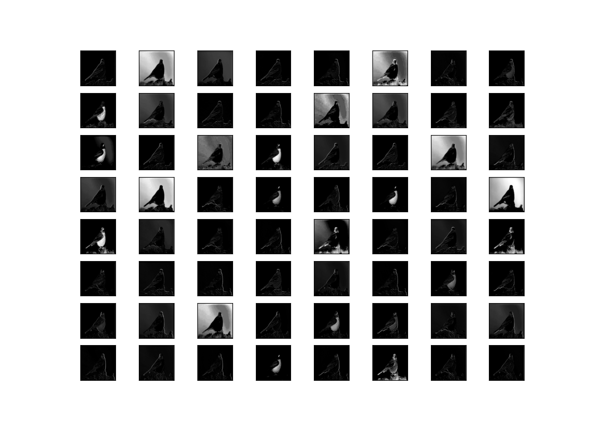
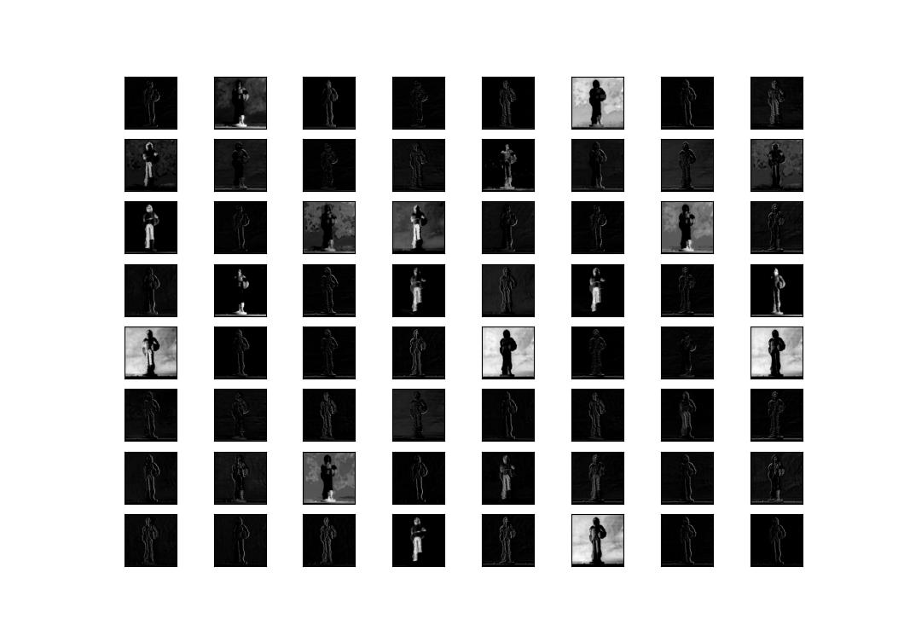

# Visualize filters and feature maps
Visualizing learnt filters and feature maps from a pre-fit CNN. VGG16 pretrained classifier network is used here.

## Visualization samples

#### Testing on a bird image

#### Testing on a doll image

## Reference
[Click here](machinelearningmastery.com)
